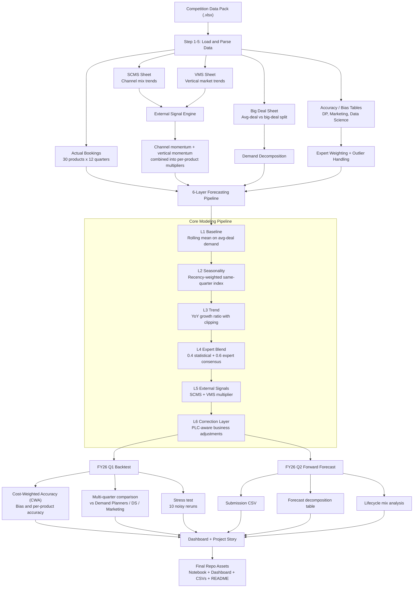

# Architecture Flow

This project is organized as a layered forecasting workflow that starts with competition data ingestion, builds product-level demand forecasts through six model stages, and ends with backtest, dashboard, and submission exports.

## What the Diagram Shows

- The notebook is not just a time-series forecast. It combines historical demand, business decomposition, expert input, and external market signals.
- The model is intentionally layered so each stage can be inspected and explained.
- The project output is broader than a single metric: it includes validation, scenario robustness, visualization, and exported deliverables.
