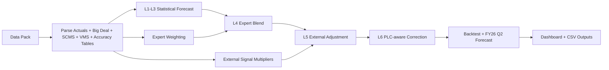
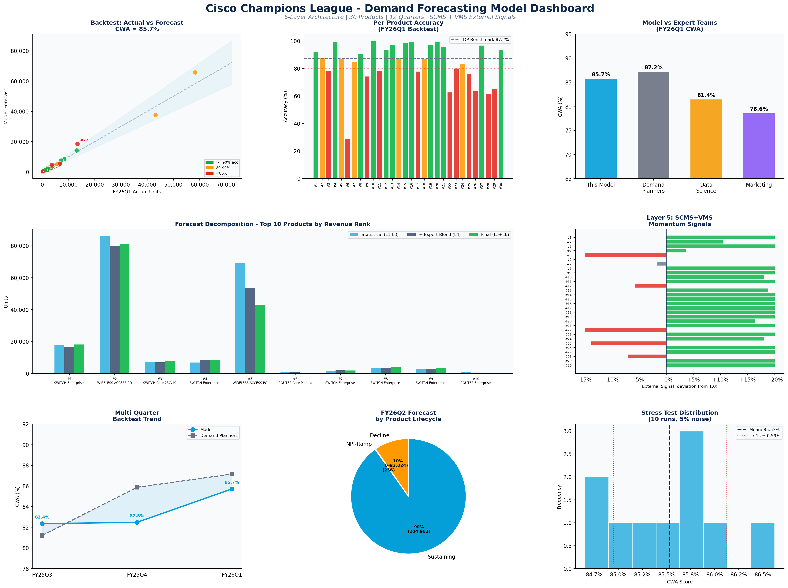

# Cisco CFL Demand Forecasting

Personal forecasting project developed for the Cisco Champions Forecasting League (CFL) Phase 1 challenge.

This notebook builds a 6-layer demand forecasting pipeline to predict FY26 Q2 unit demand for 30 Cisco networking products. The approach combines statistical forecasting, expert forecast blending, external market signals, and business-rule corrections, with an emphasis on interpretability and presentation.

## Project Highlights

- 6-layer hierarchical forecasting pipeline
- Big-deal decomposition for separating stable demand from lumpy demand
- Accuracy-weighted expert blending across Demand Planners, Marketing, and Data Science
- External signal layer built from SCMS channel trends and VMS vertical momentum
- Dashboard-based summary of backtest performance, forecast decomposition, and robustness checks

## Main Results

- FY26 Q1 backtest CWA: 85.7%
- Demand Planners benchmark: 87.2%
- Data Science benchmark: 81.4%
- Marketing benchmark: 78.6%
- Weighted multi-quarter backtest CWA: 84.1%
- Stress test mean CWA: 85.53%
- Stress test standard deviation: 0.59%

## Files

- `CFL_Forecasting_Model.ipynb` - main notebook
- `CFL_Dashboard.png` - final project dashboard
- `CFL_v2_Backtest_FY26Q1.csv` - backtest output
- `CFL_v2_Submission_FY26Q2.csv` - FY26 Q2 forecast output

## Method Overview

The forecasting pipeline is organized into six layers:

1. Baseline demand estimation
2. Seasonality adjustment
3. Trend estimation
4. Expert blend
5. External signal adjustment
6. PLC-aware correction layer

This structure was designed to keep the model interpretable, so each stage of the forecast can be inspected and explained.

## Architecture Flow

For a full project-level flow diagram, see [ARCHITECTURE.md](ARCHITECTURE.md).

## Notes

This notebook is presented as an analytical competition project. Some backtest choices, such as expert-weighting based on historical accuracy tables, can be refined further for stricter validation.

The public version of this repository does not include the original competition Excel data pack.

## Running the Notebook

This notebook was designed for Google Colab.

To run it:
1. Open `CFL_Forecasting_Model.ipynb` in Colab.
2. Upload the competition Excel data pack when prompted.
3. Run the notebook end to end to reproduce the analysis and outputs.

## Key Learnings

- Better model structure does not always improve headline backtest metrics immediately.
- Forecasting quality depends on both statistical signal and domain-informed adjustments.
- Pipeline coupling matters: changing upstream assumptions can break downstream calibration.
- Clear storytelling and visualization are as important as model logic in real-world analytics work.

## Dashboard Preview

## Author

Ayush Pandey
